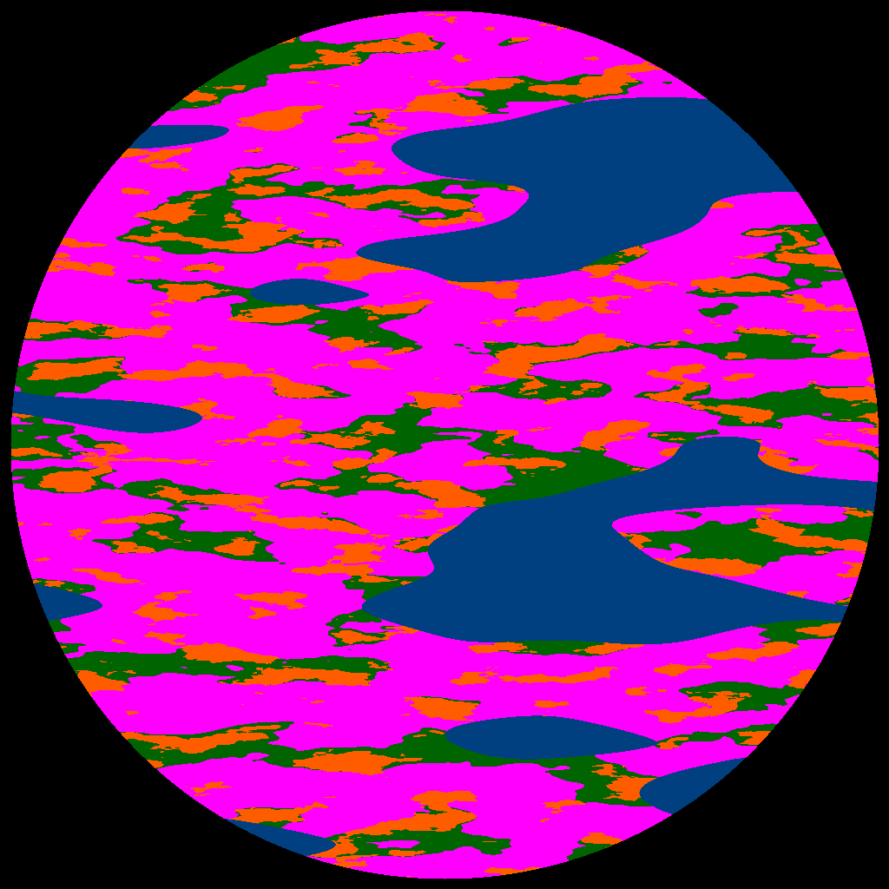

# Create a femosphere planet!

**NumPy** is a great library to draw images.
In this exercise, you will craft a planet image.

## Installation

A few libraries are required:

    pip install noise numpy Pillow

## Run the example

Start with the code in [planet.py](planet.py). Run it with:

    python planet.py

A red-purple image should pop up.

## Improvement 1: Play the Perlin function

The pattern is generated by the Perlin function.
It has two main parameters: **octaves** (raggedness) and **scale** (a zoom factor).

Modify the values and see how the image changes.

## Improvement 2: A spherical planet

Your planet should look like a planet
Uncomment the part of the code that applies the circular mask.
Then run the script again.

**Wait!** Something goes wrong. There is a black hole instead.
Find out how you can cut out the borders of the circle instead of the middle.

## Improvement 3: Rotation

For a **rotation** effect, create an Perlin mask that is 4x as high and then slice it, using only every 4th row. Modify the section calling the Perlin helper function:

    mask = get_perlin_array(height*4, width, octaves=5, scale=100)
    mask = mask[::4]
    planet[mask > 160] = RED

*OK, it is not a real spherical projection, but a nice effect anyway.*

## Improvement 4: More patterns

Copy-paste the section that creates and applies the Perlin mask (the three lines above). Then modify it:

- change the color
- change the octaves
- change the scale
- change the cutoff value (0..255)

The order of the section matters, because the patterns are painted on top of each other.

## Improvement 5: Randomness

Use `random.randint()` to use random x/y-offsets for the Perlin function.
The unit is pixels, so to see a completely different part of the Perlin space you will need to shift by 1000 or more.

**Have fun!!**

## Author

Contributed by Kristian Rother in 2026

## Links

